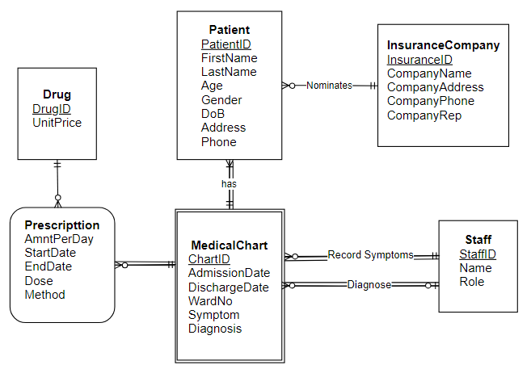
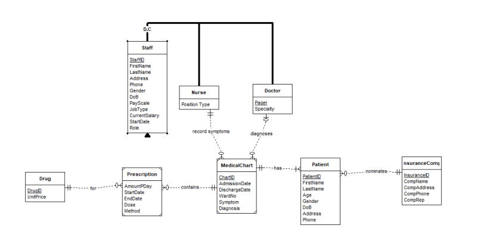
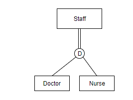
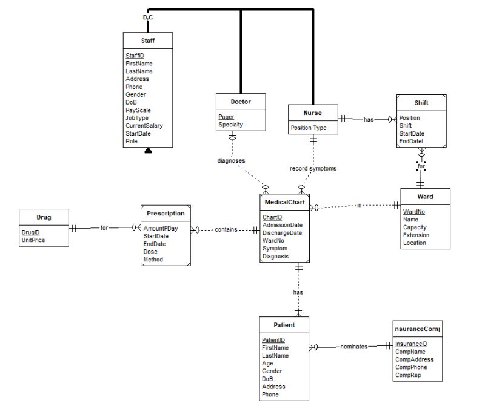
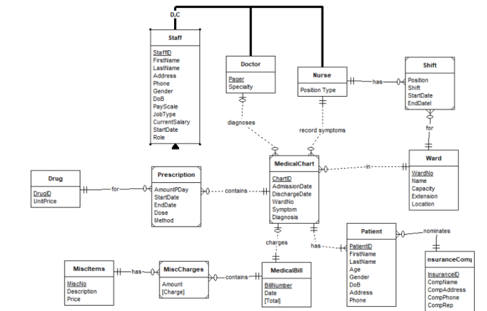

# Week 3 activities

## Lecture Activities

1. Which of the following apply to both OUTPATIENTs & RESIDENT_PATIENTs

- Checkback_D
- Date_Discharged
- Bed_ID
- `Patient_ID`

2. property by which subtype entities possess the values of all attributes of a supertype is called

- heirachy reception
- Class management
- `attrbute inheritance`
- generalization

3. Create the SUPPLIES table

||Supplies||
|---|---|---|
| PartNo | SupplierID | UnitPrice|
| 1x | s1001 | 12 |
| 1x | s2345 | 13 |
| 2z | s1001 | 25 |
| 3y | s4444 | 7 |

## Tutorial Activities

### Drug prescription (same as week2)

1. Business Rules
   - Each Drug has a unique number
   - Patient are perscibed multiple drugs
   - Amount/day, start & end date in on the prescription
2. ERD

### Staff Detail

1. Business Rules
   - Form to record staff details, can be used for both doctors & nurses (STAFF supertype ent)
   - Doctors have a pager number & Nurses have various JobPosition (Doc & Nurses subtype entity of STAFF supertype entity)
2. ERD combine with the previous ERD

The Super/Sub constraint will be a Completed Disjoint specialisation. Assuming the staff form can be used for other staffs beside Doctors & Nurses. There could be more subtypes entities for other staffs, but in this case only docs & nurses are avaliable

> 

The super/subtype relationship looks like that because of the `ER-Assistant` software, but it should look like this:

> 

### Hospital Ward

1. Business Rules
   - Each ward has a unique number
   - Nurses are allocated to different wards on a monthly roltation ( Start/End date)
   - Nurses can be allocated for Day/Night shift
2. ERD combine with the previous ERD

> 

### Bill

1. Business Rules

- On discharge, patient will be issued a bill with a UID.
- Bill contains charges for drug prescription, misc items & total fee

2. Final ERD

Justification: In this ERD, the Misc charges are seperated from the MedChart and connect directly to the MedicalBill. This decision is made because the medical chart would only by used for medical purposes(diagnosis, medicine prescription) and any extra charges is recorded on the Bill instead.

> 