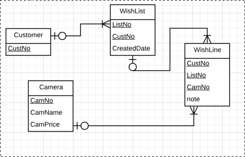
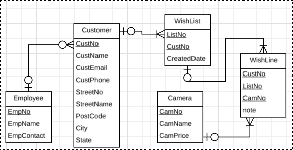

# Week 6

## Lecture 6 Activities

1. Convert “wishlist” entity to the relation.
   - wishlist(<u>ListNo, CameraNo, custNo*</u>, creadedDate, cameraName, StdPrice, note)
   - FK (custno) references customer
2. Determine FDs for the following sets of business rules.
   - Set 1:
     - **BR 4**: The system will automatically generate a unique number for a wish list of a customer in order to trace all the wish lists.
     - **BR 5**: The system also stores the date that the wish list of the customer has been created.
     - FD:
       - CustID > WishID, CreatedDate
       - WishID, CustID > CreatedDate
   - Set 2:
     - **BR 6**: A Customer can add as many cameras as he or she likes to their wish list. 
     - **BR 7**: For one and only one camera, customer can make a brief note. for example, “this is my first choice”.
     - FD
       - AttrK: Customer, Camera, WishList, Note
       - Cust, List, Cam -> Note
   - Set 3:
     - **BR 8**: A camera is described by a unique camera number, a camera name and a standard price.
     - FD: CNo > CName, CPrice
3. If the “wishList” relation is not in 3NF, normalize it.

To be 3NF the relation has to achieve:

- 1NF: contains all atomic attributes, not derrived nor multivalued.
- 2NF: must not contain attributes that are dependet a part of the key
- 3NF: must not contain attributes that are dependant on a non-key attributes

To fulfil these characteristics, here are is the new design of the relation wishList

> wishList(<u>ListNo, CustNo*</u>, CreatedDate )
>
> FK(CustNo) references Customer

> wishLine(<u>ListNo*, CustNo*, CamNo*</u>, note)
>
> FK (CustNo) references Customer
> 
> FK (ListNo) references wishList
>
> FK (CamNo) references Camera

> Customer(<u>CustNo</u>)

> Camera(<u>CamNo</u>, CamName, CamPrice)

4. Change the ERD based on the normalization results.

> 

---

## Tutorial 6 Activities

Online Camera Shop - Section 2: Employee

1. Determine business rules of the case study

- Cust register(CustID, name, email, addr,phone)
- Customer can create their own private wishlist
- Can add as many as they like
- Each entry on the list if only for 1 cam, Cust can make a brief note
- Each wishlist has a unique number & the created date
- Camera described by cam number, name & price
- Cust maybe alocated to an employee
- Employee (emNo, name, phone)
- Manager propose promotion deals for customers
- Poromotion include start date, an expiry & a discount rate for a specific model
- Some Emplouees also act as supervisors for other emps

2. Convert “customer” entity to the relation.
   - Customer(<u>CustNo</u>, custName, email, phone, custAddr, EmplNo, empName, empContact)
3. Determine FDs for the following sets of business rules.
   - Set 1:
     - BR 1: Every `customer` needs to register on the site by providing his/her personal information including **name**, **home address**, **email address** and **contact phone number**.
     - BR 2: The system will generate a `unique customer` number for each customer
     - `CustNo` > name, email, phone, custAddr
   - Set 2:
     - BR 9: A customer may be allocated to an employee of the shop.
     - CustID, EmplID
     - Cust > Empl
     - Empl > Cust
   - Set 3:
     - BR 10: Every employee has a unique employee no, a name and a contact phone number.
     - EmpID > EmName, EmContact

4. If the “customer” relation is not in Boyce-Codd Normal Form (BCNF), normalize it.

> Customer(<u>CustNo</u>, custName, email, phone, custAddr, EmplNo, empName, empContact)

- **1NF?** `NO`, custAddr is multivalued need to break it up

> Customer(<u>CustNo</u>, custName, email, phone, StreetName, StreetNumber, Post, Suburb, State, EmplNo, empName, empContact)

- **2NF?** `YES`, The relation does not contains attributes that are dependent on part of the PK.
- **3NF?** `NO`, The Relation contains attributes dependent on a non-key attribute (EmpNo). Therefore the Customer entity needs to be split into 2.

> Customer(CustNo, name , email, phone, street number, street name, post, suburb, EmpNo*)
>
> FK (EmpNo) references Employee
>
> Emplyee(EmpNo, EmName, EmContact)

5. Change the ERD based on the normalization results.

> 
