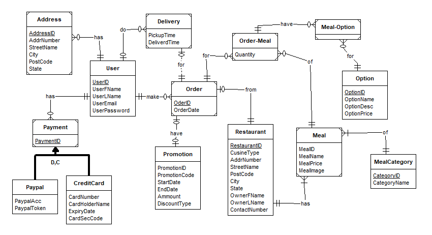
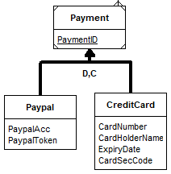
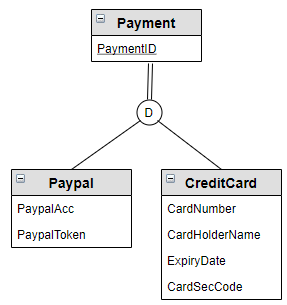
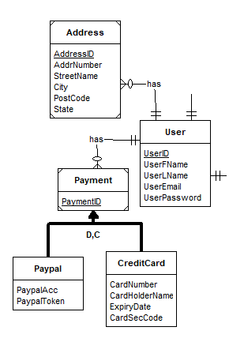
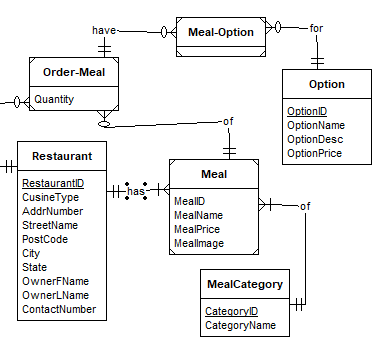
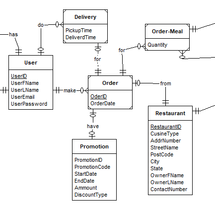

# Part B Conceptual Data Modelling

## Overview

## Business Rules

1. **User BR**
   - 1.1 Each User should be able to store multiple delivery address in their account.
   - 1.2 Each User should be able to store multiple payment methods in their account wether its a paypal account or through a creditcard.
   - 1.3 Each users will need to have a Unique Email, but for security and privacy reasons an auto generated UniqueID will be used to identify each users instead of the emails.
   - 1.4 When signing up, users will only be asked to enter an email, their name and set up a password for the account.
   - 1.5 When signing up, If the email already exist in the database, the user will be prompt to sign in with a matching password for the account
2. **Restaurants BR**
   - 2.1 The list of restaurants a user could order from is based on the distance
   - 2.2 The list of restaurants should be able to be filtered by cuisine type
3. **Menu BR**
   - 3.1 Each restaurants are able to offer multiple different meals and the meals are speparated into different categories set by the restaurant owner.
   - 3.2 users should be able to customise their meals with different options(size, extra toppings) if they wish to.
4. **Ordering BR**
   - 4.1 For logistics reasons and to keep delivery cost low, each order should only contain meals from 1 restaurant.
   - 4.2 Users should be able to order multiple different meals per order(cart)
   - 4.3 users should be able to view and edit details such as delivery address and payment method before confirming the order.
   - 4.4 If a user did not provide a delivery address/ payment method before ordering, they will be promt to provide them before checking out.
   - 4.5 users should be able to add promotional code for discounts to orders.
   - 4.6 Each order can not have more than one promo code applied.

## Conceptual Data Modelling (ERD)

Here is the ERD for the Deliveroo DB system based on the business rules

***Fig.0** Main ERD*

### Design Note

The ERD is drawn using the software **ER-Assistant**, therefore notation for super/sub-entity relationship at Payment(**fig.1**) could seem different from the regular Crows Nest notation(**fig.2**). In **Fig.1**, the bolded arrow notates that the Paypal and CreditCard entities are subtypes for the supertype Payment entity. Additionaly, the **D** and **C** means its a **Complete**/Total specilization(supertype instance must be a subtype) with **Disjointed** constraints(Supertype instance can only be one of the subtypes).

***Fig.1** ER-Assistant super/subtype* notation

***Fig.2** Crows Nest Super/Sub notation*

## Design Justification

### 1. User (*fig.3*)

***Fig.3** ERD - User*

- Regarding the Entity types of User, Payment and Address:
  - The decision to make User a strong Enity, while making Payment and Address weak entities is from:
  > **BR 1.1**: Each User should be able to store multiple delivery address in their account.
  >
  > **BR 1.2**: Each User should be able to store multiple payment methods in their account wether its a paypal account or through a creditcard.
  >
  > **BR 1.4**: When signing up, users will **only** be asked to enter an email, their name and set up a password for the account.
  - As **1.4** states that new instances of User only require only details such as Name,Email and Password. Making User a strong Entity.
  - Also in **1.1** and **1.2**, Payment and Address are dependent on Users. Hence they are weak entities
- Regarding the Relationships between User - Address and User - Payment
  - These 3 BR shows the choice for the relationship:
  > **BR 1.1**: Each User should be able to store multiple delivery address in their account.
  >
  > **BR 1.2**: Each User should be able to store multiple payment methods in their account wether its a paypal account or through a creditcard.
  >
  > **BR 1.4**: When signing up, users will **only** be asked to enter an email, their name and set up a password for the account.
  >
  > **BR 4.4** If a user did not provide a delivery address/ payment method before ordering, they will be promt to provide them before checking out.
  - BR **1.1** and **1.2** both states that the relationship between Users - Payment and Users - Address will be both **One for Users** to Many for both Payment and Address.
  - For Cardinality, BR **1.4** and **4.4** both shows that a user does not need to have any data regarding adressor payment to start using the Deliveroo Service. Hence the OneMandatory(User) to ManyOptional(Payment, Address) cardinality
- Regarding the Super/subtype entity Payment:
  - The BR **1.2** shows the need to have a super/subtype entity
  > **BR 1.2**: Each User should be able to store multiple payment methods in their account wether its a paypal account or through a creditcard.
  - Each instance of Payment would only be either an instance of Paypal or CreditCard(Total Specialization with Disjointed Constraint)

### 2. Restaurant (*fig. 4*)

***Fig.4** Restaurant ERD Section*

- Regarding the Restaurant and Meal
  - Starting with the Restaurant Entity, BR 2.1 and 2.2 show the need for Restaurant to be its own Strong Entity
  > **BR 2.1**: The list of restaurants a user could order from is based on the distance
  >
  > **BR 2.2**: The list of restaurants should be able to be filtered by cuisine type
  - Where as for Meal being a weak entity is shown in BR 3.1. The business rules also the need for the relationship between Restaurant and Meals to be One(Restaurant) to Many(Meal)
  > **BR 3.1**: Each restaurants are able to offer multiple different meals and the meals are speparated into different categories set by the restaurant owner.
  - As for the Mandatory cardinality for both side is decided through reasoning. It does not make much sense if a Restaurant does not have any meals availible for Customers to orderfrom. Also if there are meals which are not belong in any restaurants, how will they be made.
- Regarding Meal and its Categories
  > **BR 3.1**: Each restaurants are able to offer multiple different meals and the meals are speparated into different categories set by the restaurant owner.
  - BR 3.1 shows the need for the MealCategory entity. As for the mandatory cardinality for Meal, its made under the assumption of all Meal instances are required to have a category.
  - As for the mandatory cardinality for Category, it is to reduce data redundency and prevent the menu from showing empty categories.
- Regarding Meal-Options and Option
  - The Strong Entity Option is there to store different addons cutomers can add to their meals. This satisfy the BR 3.3
  > **BR 3.2** users should be able to customise their meals with different options(size, extra toppings) if they wish to.
  - As BR 3.2 requires meals can have "different options", meaning many Ordered Meals can have many Options. The Entity Order-Meal is an associative entity to break up the M:N relationship between Option and Order-Meal.
- Regarding Order-Meal

### 3. Ordering (**fig. 5**)

***Fig. 5** Order Section*

- Regarding the Order entity
- Regarding relationship with Order-Meal
- Regarding relationship with Restaurant
- Regarding relationship with Promotion
- Regarding User and Delivery entity