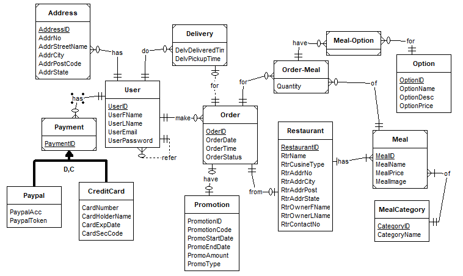

# Part C Logical Design

## I. Revised Business Rules and Assumption

1. **User BR**
   - *1.1* Each User should be able to store multiple delivery address in their account. Each Address entry are uniquely identified by a combination of a unique key plus the user's key.
   - *1.2* Each User should be able to store multiple payment methods in their account wether its a paypal account or through a creditcard. Each Payment methods are uniquely identified by a combination of a unique key plus the user's key.
   - *1.3* Each users will need to provide an unique Email, but for security and privacy reasons an auto generated UniqueID will be used to identify each users instead of the emails.
   - *1.4* When signing up, users will only be asked to enter an email, their name and set up a password for the account.
   - *1.5* When signing up, If the email already exist in the database, the user will be prompt to sign in with a matching password for the account
   - *1.6* Users could become delivery driver to deliver order if they want to. The time when the food is picked up and the time delivered to ensure the package arrived as promised
   - *1.7* Current Users can refer the Deliveroo service to their friends and families to get a reference discounts on the service.
2. **Restaurants BR**
   - *2.1* The list of restaurants a user could order from is based on the distance and for drivers to pickup orders
   - *2.2* The list of restaurants should be able to be filtered by cuisine type
   - *2.3* Each Restaurant will be given a unique identifier key and  also need to provide the contact details of the owner
   - *2.4* Restaurants need to provide Price, Name and an image of every single dish they provide. Each meal/dish/ offered product is identified using a given unique key and the restaurant's key.
3. **Menu BR**
   - *3.1* Each restaurants are able to offer multiple different meals and the meals are speparated into different categories set by the restaurant owner.
   - *3.2* users should be able to customise their meals with more than one options(size, extra toppings) if they wish to. Each Option will be given their own unique key. Selecting an option may modify the cost of the meal.
4. **Ordering BR**
   - *4.1* For logistics reasons and to keep delivery cost low, each order should only contain meals from 1 restaurant. Each order would also be only for 1 user.
   - *4.2* Order records contain the date of the order is made, and its status. Users should also be able to order multiple different meals per order.
   - *4.3* Each order will need to store the inital date when the order starts. Users should also be able to view and edit details such as delivery address and payment method before confirming the order.
   - *4.4* If a user did not provide a delivery address/ payment method before ordering, they will be promt to provide them before checking out.
   - *4.5* users should be able to add promotional code for discounts for their order.
   - *4.6* Each order can not have more than one promo code applied.
   - *4.7* Each PromoCode are only applicable in a certain period and the code can either give a percentage or a flat rate discount

## II. Revised ERD

- Here is the new and revises design of the Entity Relation Diagram. Also included below is the list of changes since the previous report.

ChangeNotes:

- Changed the naming format of attributes.
- Added a 1 mandatory : 1 optional **Unary** realationship for the User. This is to fit the reviesd BR
 will need to nique Email, but for security and privacy reasons an auto generated UniqueID will be used to identify each users instead of the emails.

> Current Users can refer the Deliveroo service to their friends and families to get a reference discounts on the service

## III. Relation

This section contain the converted relation from entities in the ERD.

### Customer

- **User**

> **USER**(<u>UserID</u>, UserFName, UserLName, UserEmail, UserPassword, RefereeID*)
>
> FK(RefereeID) references USER

- **Address**

> **ADDRESS**(<u>AddressID, UserID*</u>, AddrNo, AddrStreetName, AddrCity, AddrPostCode, AddrState)
>
> FK (UserID) references User

- **Payment**

> **PAYMENT**(<u>PaymentID, UserID*</u>)
>
> FK (UserID) references USER

- **Creditcard** (subtype of Payment)

> **CREDITCARD**(<u> PaymentID, UserID*</u>, CardNum, CardHolderName, CardExp, CardSecCode)
>
> FK (UserID) references USER

- **Paypal**

> **PAYPAL**(<u>PaymentID, UserID*</u>, PaypalAcc, PaypalToken)
>
> FK (UserID) references User

### Restaurant Section

- **Restaurant**

> RESTAURANT(<u>RestaurantID</u>, RtrCusineType, RtrAddrNumber, RtrStreetName, RtrPost, RtrCity, RtrState, RtrOwnerFname, RtrOwnerLName, RtrContactNo)

- **Meal**

> **MEAL** (<u> MealID, RestaurantID*</u>, MealName, MealPrice, MealImage, CategoryID*)
>
> FK (RestaurantID) references RESTAURANT
> 
> FK (CategoryID) references MEALCATEGORY

- **MealCategory**

> **MealCategory** (<u>CategoryID</u>, CategoryName)

- **Option**

> **OPTION** (<u>OptionID</u>, OptionName, OptionDesc, OptionPrice)

- **Order-Meal**

> **ORDERMEAL** (<u>OrderID*, MealID* ,ReastaurantID*</u>, Quantity)
>
> FK (OrderID) references ORDER
>
> FK (MealID) references MEAL
>
> FK (RestaurantID) references RESTAURANT

- **Meal-Option**

> **MEALOPTION** (<u>OrderID*, MealID* ,OptionID</u>)
>
> FK (OrderID) references ORDER
>
> FK (MealID) references MEAL
>
> FK (OptionID) references OPTION

### Order Section

- **Order**

> ORDER (<u>OrderID, RestaurantID*, UserID*</u>, OrderDate, OrderTime, AddressID*, PaymentID*)
>
> FK (RestaurantID) references RESTAURANT
>
> FK (UserID) references USER
>
> FK (AddressID) references ADDRESS
> 
> FK (PaymentID) references PAYMENT

- **Delivery**

> **DELIVERY** (<u>OrderID*, DriverID*</u>, PickupTime, DeliveryTime)
>
> FK (OrderID) references ORDER
>
> FK (DriverID) references USER

- **Promotion**

> **PROMOTION** (<u>PromotionID</u>, PromoCode, PromoStartDate, PromoEndDate, DiscAmount, DiscType).

## IV. List of Functional Dependancies related to BR

This secion present Functional Dependancies extracted from business rules. For organisational purposes, 

### User Functional Dependancies

**Regarding Address**

- *1.1* Each User should be able to store multiple delivery address in their account. Each Address entry are uniquely identified by a combination of a unique key plus the user's key.
  - **U-FD1**: `User → Address`
  - **U-FD2** `UserID, AddressID → Address Attributes`

**Regarding Payment**

- *1.2* Each User should be able to store multiple payment methods in their account wether its a paypal account or through a creditcard. Each Payment methods are uniquely identified by a combination of a unique key plus the user's key.
  - **U-FD3**:`User → Payment`
  - **U-FD4**: `UserID, PaymentID → Paypal Details, CreditCard Details`

**Regarding User**

- *1.3* Each users will need to provide an unique Email, but for security and privacy reasons an auto generated UniqueID will be used to identify each users instead of the emails.
- *1.4* When signing up, users will only be asked to enter an email, their name and set up a password for the account.
  - **U-FD5**: `UserID → UserEmail, UserPassword, User Name`
- *1.6* Users could become delivery driver to deliver order if they want to. The time when the food is picked up and the time delivered to ensure the package arrived as promised
  - **U-FD6**:`Driver, OrderID → UserID, PickupTime, DeliveredTime`
    - Under the assumption of each Driver will deliver the order to the assigned User/orderer.
  - **U-FD7**: `User → Driver`
  - **U-FD8**: `Driver → User`
    - **UFD7** and **UFD8** references a user can be a driver if they want to
- *1.7* Current Users can refer the Deliveroo service to their friends and families to get a reference discounts on the service.
  - **U-FD9**: `Referer → User`
  - **U-FD10**: `User → Referer`
    - **UFD9** and **UFD10** references a user can also be a referee for another user.

### Restaurant Functional Dependancies

- *2.1* The list of restaurants a user could order from is based on the distance and for drivers to pickup orders
  - Notates restaurants must provide an address to use the Deliveroo service.
- *2.2* The list of restaurants should be able to be filtered by cuisine type
- *2.3* Each Restaurant will be given a unique identifier key and  also need to provide the contact details of the owner
  - **R-FD1**: `RestaurantID - Owner's Name, ContactNumber, CusineType, Address`
  - Combination of BR *2.1*, *2.2* and *2.3*.
- *2.4* Restaurants need to provide Price, Name and an image of every single dish they provide. Each meal/dish/ offered product is identified using a given unique key and the restaurant's key.
  - **R-FD2**: `RestaurantID → MealID`
  - **R-FD3**: `RestaurantID, MealID → MealName, MealPrice, MealImage`
- *3.1* Each restaurants are able to offer multiple different meals and the meals are speparated into different categories set by the restaurant owner.
  - **R-FD4**: `RestaurantID, MealID → Category`
- *3.2* users should be able to customise their meals with more than one options(size, extra toppings) if they wish to. Each Option will be given their own unique key. Selecting an option may modify the cost of the meal.
  - **R-FD5**: `OptionID → OptionName, OptionPrice`
    - Assuming when an option is selected for the chosen order, the price stored for option will be added into the total cost.
  - **R-FD6**: `OrerID, UserID, MealID → OptionID, OptionName, OptionPrice`
    - Expanding from **O-FD2**(see below), **R-FD6** is used to show when an aditional option is applied to a specific item on the order.

### Order Functional Dependancies

- *4.1* For logistics reasons and to keep delivery cost low, each order should only contain meals from 1 restaurant. Each order would also be only for 1 user.
- *4.2* Order records contain the date of the order is made, and its status. Users should also be able to order multiple different meals per order.
  - **O-FD1**: `OrderID, UserID → RestaurantID`
  - **O-FD2**: `OrderID, UserID → MealID, MealName, MealPrice, MealImage, MealQuantity`
    - BR *4.1* notate that OrderID, UserID will be the CompositePK for each order. Thus `OrderID, UserID, and MealID` will be the composite PK for each item in each order.
    - Note: the meal quantity is to depict the number of a specific meal that the user want to order.
- *4.3* Each order will need to store the inital date when the order starts. Users should also be able to view and edit details such as delivery address and payment method before confirming the order.
- *4.4* If a user did not provide a delivery address/ payment method before ordering, they will be promt to provide them before checking out.
- *4.5* users should be able to add promotional code for discounts for their order.
  - **O-FD3**: `UserID, OrdeCREATE TABLE Customer_T(
    CustID          NUMBER(11,0)    NOT NULL,
    CustName        VARCHAR2(25)    NOT NULL,
    CustStreet      VARCHAR2(30),
    CustCity        VARCHAR2(20),
    CustState       CHAR(2),
    CustPostalCode  VARCHAR2(9),
CONSTRAINT Customer_PK PRIMARY KEY (CustID));rID → OrderDate, Payment(PaymentAttributes), Address(AddressAttributes), Restaurant(Restaurant Attributes), Meal(and meal's Attribues), Option(and OptionAttributes), PromotionCode(promo attributes)`
  - Combination of BR *4.3*, *4.4*, and *4.5. Additionally also apply previous FDs.
- *4.7* Each PromoCode are only applicable in a certain period and the code can either give a percentage or a flat rate discount
  - `PromotionID → PromoStartDate,PromoEndDate, Promocode, PromoDiscountType, PromoDiscountRate`

## V. Normalisation

This section will examine each relations previously converted from the ERD and use the functional dependancies to check if they have reached the 3rd normalization form. A 3rd normal form include these characteristis:

- 1NF: All Attributes must be atomic and not derrived.
- 2NF: Every Non-Key attribute must be defined by the whole key.
- 3NF: No Transitive dependancies, where the PK is a determinant for an attribute which is a determinant for other attributes.

### **User**

- Relation

> **USER**(<u>UserID</u>, UserFName, UserLName, UserEmail, UserPassword, RefereeID*)
>
> FK(RefereeID) references USER

- Related FD:
  - **U-FD5**: `UserID → UserEmail, UserPassword, User Name`
  - **U-FD9**: `Referer → User`
  - **U-FD10**: `User → Referer`
- Note: **U-FD9** and **U-FD10** depict it is a unary relationship, Hence the `RefereeID` presented in the relation.
- Normal Form:
  - 1NF: All Attributes in the relation are atomic and not derrived.
    - **U-FD5** still have an composite attribute `UserName`, should be broken down to `FirstName` and `LastName`.
  - 2NF: Every Non-Key attr is defined by the whole key.
  - 3NF: No Transitive dependancies. Even though `RefererID` is a determinant for the attributes of `User` it is presented in the relation as a ForeignKey which only show the relationship.

**Address**

- Relation:

> **ADDRESS**(<u>AddressID, UserID*</u>, AddrNo, AddrStreetName, AddrCity, AddrPostCode, AddrState)
>
> FK (UserID) references User

- Related FD:
  - **U-FD1**: `User → Address`
  - **U-FD2** `UserID, AddressID → Address Attributes`
- Normal Form:
  - 1NF: All Attributes in the relation are atomic and not derrived. For **U-FD2**, the address attributes will need to be broken down to record the StreetNumber, StreetName, City, PostCode, and State of each `Address` entry.
  - 2NF: Every Non-Key attr is defined by the whole key.
  - 3NF: No Transitive dependancies.

**Payment**

- Relation:

> **PAYMENT**(<u>PaymentID, UserID*</u>)
>
> FK (UserID) references USER

- Related FD:
  - **U-FD3**:`User → Payment`
- Note: Supertype Entity
- Normal Form:
  - 1NF: All Attributes in the relation are atomic and not derrived.
  - 2NF: There are no non-key attributes in the relation.
  - 3NF: There are no non-key attributes(where its a determinant for other attributes) in the relation.

**Creditcard** (subtype of Payment)

- Relation:

> **CREDITCARD**(<u> PaymentID, UserID*</u>, CardNum, CardHolderName, CardExp, CardSecCode)
>
> FK (UserID) references USER

- Related FD:
  - **U-FD4**: `UserID, PaymentID → Paypal Details, CreditCard Details`
- Note: SubType entity of Payment Entity
- Normal Form:
  - 1NF: All Attributes in the relation are atomic and not derrived. Not all Attributes(`PaypalDetails` and `CreditCardDetails`) in the fd are atomic and will need to be broken down.
  - 2NF: There are no non-key attributes in the relation nor the FD. Technically the FD is correct, but since `CREDITCARD` is a subtype of `Payment`, it only contains the `CreditCard` related attributes.
  - 3NF: No Transitive dependancies.

**Paypal**

- Relation:

> **PAYPAL**(<u>PaymentID, UserID*</u>, PaypalAcc, PaypalToken)
>
> FK (UserID) references User

- Related FD:
  - **U-FD4**: `UserID, PaymentID → Paypal Details, CreditCard Details`
- Note: SubType entity of Payment Entity
- Normal Form:
  - 1NF: All Attributes in the relation are atomic and not derrived. Not all Attributes(`PaypalDetails` and `CreditCardDetails`) in the fd are atomic and will need to be broken down.
  - 2NF: There are no non-key attributes in the relation nor the FD. Technically the FD is correct, but since `PayPal` is a subtype of `Payment`, it only contains the `CreditCard` related attributes.
  - 3NF: No Transitive dependancies.

### Restaurant Section

**Restaurant**

- Relation:

> RESTAURANT(<u>RestaurantID</u>, RtrCusineType, RtrAddrNumber, RtrStreetName, RtrPost, RtrCity, RtrState, RtrOwnerFname, RtrOwnerLName, RtrContactNo)

- Related FD:
  - **R-FD1**: `RestaurantID - Owner's Name, ContactNumber, CusineType, Address`
- Normal Form:
  - 1NF: All Attributes in the relation are atomic and not derrived. In the FD, `Owner'sName` and `Address` would need to be broken down.
  - 2NF: Every Non-Key attribute in the relation is defined by the whole key.
  - 3NF: No Transitive dependancies

**Meal**

- Relation:

> **MEAL** (<u> MealID, RestaurantID*</u>, MealName, MealPrice, MealImage, CategoryID*)
>
> FK (RestaurantID) references RESTAURANT
> 
> FK (CategoryID) references MEALCATEGORY

- Related FD:
  - **R-FD2**: `RestaurantID → MealID`
  - **R-FD3**: `RestaurantID, MealID → MealName, MealPrice, MealImage`
- Normal Form:
  - 1NF: All Attributes in the relation are atomic and not derrived.
  - 2NF: Every Non-Key attribute in the relation is defined by the whole key.
  - 3NF: No Transitive dependancies.

**MealCategory**

- Relation:

> **MealCategory** (<u>CategoryID</u>, CategoryName)

- Related FD:
  - **R-FD4**: `RestaurantID, MealID → Category`
- Note: The FD depict what Category is depend on in the Meal relation.
- Normal Form:
  - 1NF: All Attributes in the relation are atomic and not derrived.
  - 2NF: Every Non-Key attribute in the relation is defined by the whole key.
  - 3NF: No Transitive dependancies.

**Option**

- Relation:

> **OPTION** (<u>OptionID</u>, OptionName, OptionDesc, OptionPrice)

- Related FD:
  - **R-FD5**: `OptionID → OptionName, OptionPrice`
- Normal Form:
  - 1NF: All Attributes in the relation are atomic and not derrived. The FD is only missing the `OptionDescription` attribute, which is used to show what the extra option includes for the user.
  - 2NF: Every Non-Key attribute in the relation is defined by the whole key.
  - 3NF: No Transitive dependancies.

**Order-Meal**

- Relation:

> **ORDERMEAL** (<u>OrderID*, MealID* ,ReastaurantID*</u>, Quantity)
>
> FK (OrderID) references ORDER
>
> FK (MealID) references MEAL
>
> FK (RestaurantID) references RESTAURANT

- Related FD:
  - **O-FD2**: `OrderID, UserID → MealID, MealName, MealPrice, MealImage, MealQuantity`
- Normal Form:
  - 1NF: All Attributes in the relation are atomic and not derrived.
  - 2NF: Every Non-Key attribute in the relation is defined by the whole key.
  - 3NF: No Transitive dependancies in the relation. But the `Meal` related attributes will need to be removed as they are determinant attributes of `MealID`.
- Note: In the relation, the attribute `RestaurantID` might need to be removed from the CompositePK of `ORDERMEAL` because the FD notates that `OrderID` and `UserID` is enough to determine the chosen meals.
- New **Order-Meal** Relation:

> **ORDERMEAL** (<u>OrderID*, UserID, MealID*</u>, Quantity)
>
> FK (OrderID) references ORDER
>
> FK (MealID) references MEAL

**Meal-Option**

- Relation:

> **MEALOPTION** (<u>OrderID*, MealID* ,OptionID</u>)
>
> FK (OrderID) references ORDER
>
> FK (MealID) references MEAL
>
> FK (OptionID) references OPTION

- Related FD:
  - **R-FD6**: `OrerID, UserID, MealID → OptionID, OptionName, OptionPrice`
- Normal Form:
  - 1NF: All Attributes in the relation are atomic and not derrived.
  - 2NF: Relation does not contain Non-Key Attribute that are derrived from part of the key.
  - 3NF: No Transistive Dependancies.

### Order Section

**Order**

- Relation:

> ORDER (<u>OrderID, RestaurantID*, UserID*</u>, OrderDate, OrderTime, AddressID*, PaymentID*)
>
> FK (RestaurantID) references RESTAURANT
>
> FK (UserID) references USER
>
> FK (AddressID) references ADDRESS
> 
> FK (PaymentID) references PAYMENT

- Related FD:
  - **O-FD3**: `UserID, OrderID → OrderDate, Payment(PaymentAttributes), Address(AddressAttributes), Restaurant(Restaurant Attributes), Meal(and meal's Attribues), Option(and OptionAttributes), PromotionCode(promo attributes)`
- Normal Form:
  - 1NF: All Attributes in the relation are atomic and not derrived.
  - 2NF: All Non-Key attributes are not derrived from part of the Key
  - 3NF: In the fd, there is alot of non-key attributes(attr of Payment, Address, Meal, Option, Promotion) which are determined by other attributes(ForeignKeys). Other than that the relation is correcly in 3NF form.
  - Note: Same as **Meal-Order**, `RestaurantID` should be removed from the PK and become just a normal FK.
- New **Order** relation:

> ORDER (<u>OrderID, UserID*</u>, OrderDate, OrderTime, AddressID*, PaymentID*, RestaurantID*)
>OrderID
> FK (RestaurantID) references RESTAURANT
>
> FK (UserID) references USER
>
> FK (AddressID) references ADDRESS
> 
> FK (PaymentID) references PAYMENT

**Delivery**

- Relation:

> **DELIVERY** (<u>OrderID*, DriverID*</u>, PickupTime, DeliveryTime)
>
> FK (OrderID) references ORDER
>
> FK (DriverID) references USER

- Related FD:
  - **U-FD6**:`Driver, OrderID → UserID, PickupTime, DeliveredTime`
  - **U-FD7**: `User → Driver`
  - **U-FD8**: `Driver → User`
- Normal Form:
  - 1NF: All Attributes in the relation are atomic and not derrived.
  - 2NF: All the attributes in the relation are defined by the whole key. Comparing with the FD, it is missing `UserID` which can be derrived from `OrderID`. Therefore if `UserID` is included in the relation, the relation will not achieve the 2nd normal form.
  - 3NF: No Transistive dependancies.

**Promotion**

- Relation:

> **PROMOTION** (<u>PromotionID</u>, PromoCode, PromoStartDate, PromoEndDate, DiscAmount, DiscType).

- Related FD:
  - `PromotionID → PromoStartDate,PromoEndDate, Promocode, PromoDiscountType, PromoDiscountRate`
- Normal Form:
  - 1NF: All Attributes in the relation are atomic and not derrived.
  - 2NF: Every Non-Key attribute must be defined by the whole key, All of the information about Promotion code is dependant on the `PromotionID`
  - 3NF: No Transistive dependancies.

## VI. Reflection

- **What did you already know about the content and skills that were presented in this lecture?**
  - I was shown how to design an ERD and work with "SeeQUel"(Specificly SQLServer) in TAFE through their programming/ software dev course. So I would say about 70% of the coursework.
  - TAFE shown me how to a secure DB(atleast against injections) and intergrated it with a MVC webapp. The final project is to build a functional e-commerce site with APIs to get/generate data from the db.
  - This is not a complaint as I understand that this course was made to introduce Db to first year students.
- **What did you learn about the content or skills that were presented in this class?**
  - Using Normalization as an extra step of verifying your db design. Even though it wasnt shown very well ( not the fault of the lecturer and tutor) due to the structure of the course.
  - Or it could be the ERD process was shown so well that normalization seems obsolete.
  - It took me a while to understand that this is not a following process after completing the ERD but an alternative method of db design process or a verification method for the existing ERD design.
- **How did doing the assignment change your understanding about this subject?**
  - Not much, I would say that this assessment only provided  more much needed practice for normalization and ERD design.
  - Beside that, the assessment shown me the importance of constantly reviewing your design to gradually improve and build it to satisfy given requirements.
  - I am still very unsure about normalization part of how it should look like.
- **What connections have you made between this subject and other subjects you have taken?**
  - Not much aside from other subjects such as BRM also using Db in the coursework.
  - This is only my second semester at and so far, I dont think UTS intergrates related subjects very well. e.g big difference in the notation used in BRM and DBFun.
- **What do you suggest for your further improvements in this subject?**
  - A more math like approach, using different smaller bite size usecase to actually apply and practice what is taught in class (building ERD, normalization).
  - Don't just stick with one case study, have several examples for students to practice the processes of normalisation.
  - I understand using the same Hospital use case is to simulate how DB are developed in the real world, but it is very difficult to understand the process if its not applied to different scenarios, They do not need to be big and intricate use case like the Hospital to achieve this
  - I perfer the approach similar to how the SQL tutes are carried out, build queries to get certain data.