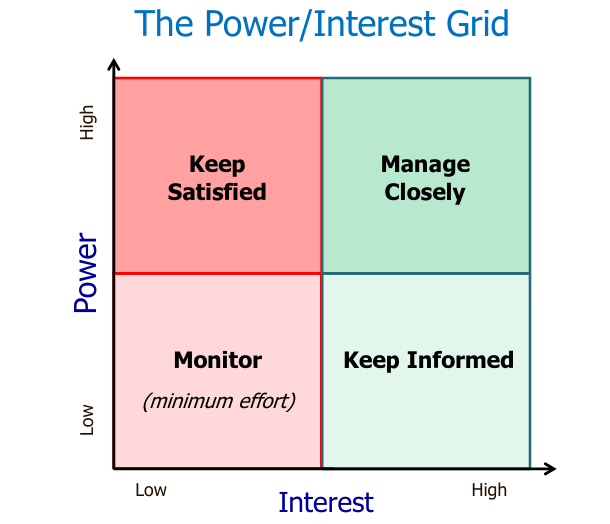

# projects, concepts and stakeholders

## topics

- context of project management
- project lifecycle
- project management framework
- stakeholder management
- communication management

### review

- project management is the tools, techniques, processes to project activities in order to meet project requirements

---

## successful project

Successful project management mean meeting the triple goals constraints
- scope
- time
- cost

A successful project
- deliver its functionality
- meet quality threshold
- achieves its stated business purpose and objectives
- finishes on budget, time and to requirements
- key stakeholders happy with outcome

**large projects fails more often than small projects**

> can project management success and project success the same thing
>
> NO, projects can be a technical success and still be an organizational failure

---

## project success - winning hand

1. Keep the project small (modest/optimized scope)
2. the product owner/ sponsor must be highly skilled
3. Agile project
4. highly skilled team
5. emotional maturity

covering areas needs to be planned
- **stakeholder**'s needs and expectations 
- communication management

---

## stakeholder management

**stakeholders**
- individuals, group or organizations with a stake/claim in project's outcome
- not all stakeholders have the same objectives
- different type of stakeholders
  - internal to the project team
  - external to the project team, in the org
  - external to the org

### PM role

- recognize the different interest of stakeholders
- reconcile competing interests between stakeholders
- continually communicate with stakeholder
- ensuring a continuing commitment from stakeholders

### stakeholder analysis 

checklist
- [ ] develop list of stakeholders with interest in the project
- [ ] identify their type of interest in project
- [ ] gauge their influence over project 
- [ ] define a role for each stakeholder
- [ ] identify an objective for each stakeholder
- [ ] identify strategies for each stakeholder
- [ ] decide communication needs for each stakeholder (communication management)

### analysis chart

|stakeholder|interest|influence|role|objective|strategy|
|:---|:---|:---|:---|:---|:---|
|dev|mid|low|develop software|complete tasks|agile|

- **objective** what is their goal for this project
- **strategy** strategy to keep the stakeholder involved

### stakeholder prioritization

> https://youtu.be/fbUM12IiGms

---

## communication management

- key skill for PM
- priority for PM and the team
  - surprises are bad in projects
  - PMs must identify problems, challenges and issues early
  - communicate this along with alternatives to overcome problem, challenges and issues
  - stakeholder need to know

> lack of communication will lead to incorrect assumptions

Communication planning
1. how will the information be stored?
2. what info goes to whom, how often and how?
3. who can access the information
4. who will update/keep the current information
5. what method/media of communication is best

performance reporting to stakeholders
- right info to the right people in the right format
- satisfy stakeholder that progress expectations are being met
- help stakeholder make educated decisions regarding the project

> detailed stakeholder analysis is prequesite to good communications planning/management

### communication management plan matrix

> recently, also seeing use of project websites for easy project communications

---

## questions

---

## summary

- context of project management
- project success
- project life cycle
- project management framework
- stakeholder management
- communication management

