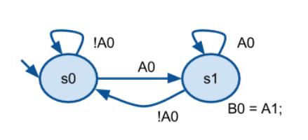
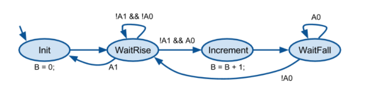
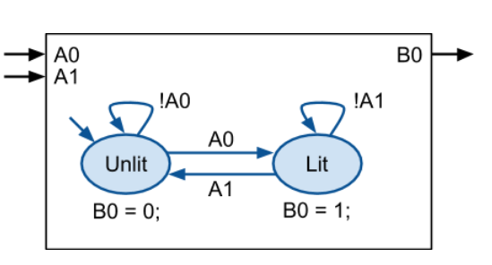
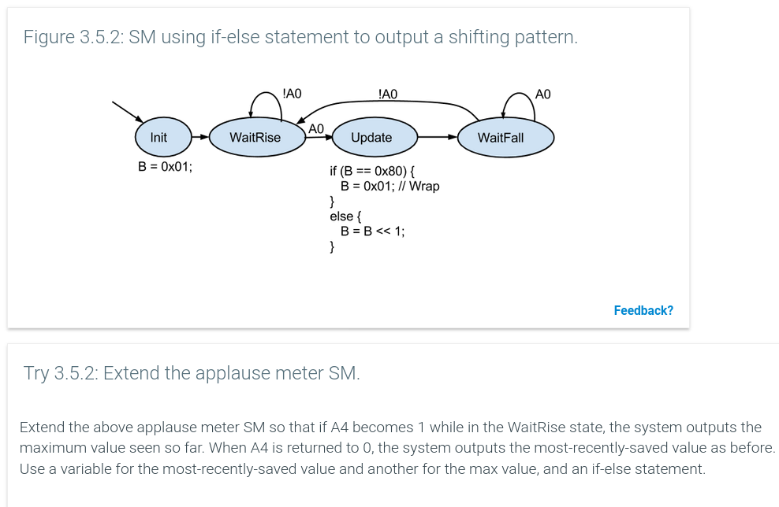
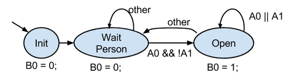

## time order behavior

- output depends on the order of which output occurs
  - what happens when an input changed
- `c` not designed for time-ordered behavior involving i/o values, it use **sequential instructions computation model**
- good for capturing algos that transform input to output (**data processing behavior**)

```c
// exteded carousel, harder to understand 
// bc sequential instruction model not made dor capturing time behavior
#include "RIMS.h"
void main()
{
    B = 0;
    while(1) {
        while(!A1 && !A0);
        if(A1) B = 0;   // reset count
        else {          // count pulse
            B = B +1;
            While (A0); 
        }
    } 
}
```

---

## state machine 

- computation model for **capturing** time ordered behavior(many types exist)
- common features:
  - set of i/o
  - set of **states** with actions (the circle)
  - set of **transitions** with conditions (arrow lines)
- system described by SM as 
  - at anytime, the system is in a state (**current state**)
  - upon starting, system transition to the initial state and execute the action (**tick**)
- for state machine to be precisely defined, transition should have **mutually exclusive conditions
  - only 1 condition could be true at anytime
  - which state will the system choose if the multiple conditions are true
  - **non deterministic** state machine

---

## Implementing SM in `c`

- since microprocessors have `c` compilers and not SM compulers
  - necessary to implement SM in `c`

example of [latch](./latch.c)
    


good SM practices
- initializing input in `main`
- include `default` in `switch` even if not needed for safety purposes
  - incase your SM ran into trouble and is stuck in a state

[carousel SM](./carousel.c)



[light toggle sm](./light_toggle.c)



---

## Variables, statements and conditions in SMs

- SM can have vars declared at SM scope (not in state)
- which can be accessed by all actions and conditions of SM
- `good practice` create a state named `Init` to carry out initialization of vars and outputs 

[system to count instances driving without seatbelt]()

### statements

- statement can appear in actions can be more than assignment statements
  - regular code is ok too
- state actions can include `for`, function call, `if` as long as 
  - it doesnt wait on an input

[3.5.2 applause meter sm]()



[3.5.3 sm with loop]()

### conditions

> exactly 1 of a state exiting transition shouldd have a condition evaluated to true at a given time.
>
> so the next state for each tick is precisely and clearly defined

- common error
  - create transition leaving a state whose condition are not mutually exclusive
  - e.g uses `A1` or `A0` and they can be both true at the same time, not clear  
  - using `!A1&&A0` and fail to consider `!A1&&!A0`
    - its not wrong but SM will become non-deterministic, as the model does not define which of the two true transition will be taken.
- for convinience, this SM oses `other` condition to indicate the transition that should be taken if none other normal condition is true
> else statement in transition switch

[door system]()



---

## Mealy actions