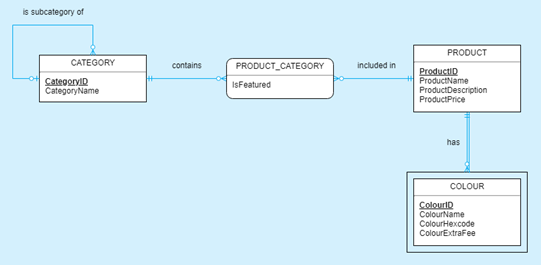
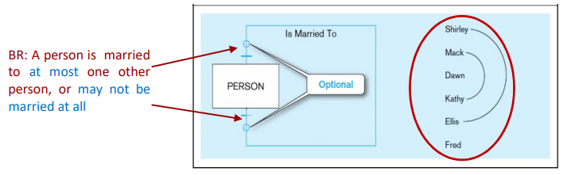
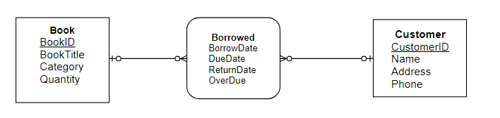

## Chapt 2

# Data Modelling II (Conceptual Level)

## Objectives


- [Data Modelling II (Conceptual Level)](#data-modelling-ii-conceptual-level)
  - [Objectives](#objectives)
  - [Review](#review)
        - [Activity 2.1](#activity-21)
  - [1. Relationship](#1-relationship)
    - [1.1 Relation ship types and instances](#11-relation-ship-types-and-instances)
    - [1.2 Degree of Relationships](#12-degree-of-relationships)
      - [Activity 2.2](#activity-22)
    - [1.3 Cardinality of Relationships](#13-cardinality-of-relationships)
      - [Activity 2.3](#activity-23)
      - [Cardinality Constraints](#cardinality-constraints)
      - [Activity 2.4](#activity-24)
      - [Activity 2.5](#activity-25)
    - [1.4 Multiple Realtionship Between Entities](#14-multiple-realtionship-between-entities)
    - [1.5 Multivalued Attributes can be represented as relationships](#15-multivalued-attributes-can-be-represented-as-relationships)
    - [1.6 Relationships can have attributes](#16-relationships-can-have-attributes)
    - [1.7 Assocuative Entities](#17-assocuative-entities)
      - [Activity 2.6](#activity-26)
      - [Activity 2.7](#activity-27)
    - [1.8 Identifying Relationships: Strong v Weak Entities](#18-identifying-relationships-strong-v-weak-entities)
      - [Activity 2.8](#activity-28)
  - [Notations](#notations)
    - [2.1 basic E-R notation](#21-basic-e-r-notation)
    - [2.2 Crow's foot Notation](#22-crows-foot-notation)
  - [Summary](#summary)

## Review

- **Business Rules**
  - Statements that define/constrain some aspect of the business
  - Derrived from policies, procedure, events, funcs
  - Assert Business Structure
  - Control/influence business behavior
  - Expressed in simple language, familiar to end users
  - Automated through DBMS
- **Entities**
  - **Entity**: Person, place, obj, event, concept in the user-env which will be gathered and stored as data (table)
  - **Entity Instance**: single entry on an entity type (`row`)
  - **Entity Type**: Collection of entity instances that share common props or chars
- **Attribute**
  - Prop or characteristics of an entity or relationship type( Table field)
  - **Identifier** an attribute or combination of attributes that uniquely identify individual instances of an entity type `PK` & `FK`
    - **Simple**(one pk) v **Composite** (multiple fk)
    - **Candidate Identifyer**: attribute/s that **could** be a key that satisfies the requirement for being an identifier.

##### Activity 2.1

Which one of the following terms fit this definition?

>"An attribute that may take on **more than one value** for a
given entity instance.“

- `Multivalued attribute`
- Derived attribute
- Cardinality constraint
- Special attribute

---

## 1. Relationship

- **Relationship Instance**: Link between entity instances (Pk - Fk)
- **Relationship Type**: Category/model of relationship, link between entity type

### 1.1 Relation ship types and instances

- **Relationship Type** is **modeled** as linbes btween entity types
- **Relationship instances** is btween specific entity instances (m:m)

### 1.2 Degree of Relationships

- basicly the number of **Entity types** that participate in it
  - **Unary**
    - One Entity related to another of the **same Entity type**
  - **Binary**
    - Entities of 2 different types related to each other
  - **Ternary**
    - 3 different types related to each other.

#### Activity 2.2

> Uses for Question 2, 5 and 8.

> **Clothing Shop Case Study:** A clothing store has a variety product which they sell online. To make things easier for customers to navigate the online store, the products are separated into categories with popular products being featured in each. Each product can come in different colours which each include additional fees.
>
> 

The **Degree of relationship in Clothing ERD**

- Category : Category `Unary`
- Category : Product_category `Binary`
- Product : Product_category `Binary`
- Product : Colour `Binary`

### 1.3 Cardinality of Relationships

- One-to-One
- One-to-Many
- Many-to-Many

#### Activity 2.3

- Example of **One-to-One** :
  - Each student have one different consession opal card
- Example of **One-to-Many** :
  - Each person have many interest
  - Each Student, One instructor
- Example of **Many-to-Many**:
  - Student m:m Classes
  
#### Cardinality Constraints

are the number of instances of 1 entity that can/must be associated with each instance of another entity

- Minimum Cardinality
  - Optional/mandatory
- Maximum Cardinality: upper limit

> Look at te examples s16 - 18

```md
----||- mandatory 1

----|<- mandatory many

----o|- optional 1

----o<- optional many
```

#### Activity 2.4

Draw Table related to:

> 

|PID | P_name | P_age | P_spouse |
|---|---|---|---|
|p001| Shirley | 30 |p005|
|p002| Mack |22 |p004|
|p003| Dawn | 24 ||
|p004| Kathy | 28 |p002|
|p005| Elis | 34 | p001|
|p006| Fred | 37 ||

#### Activity 2.5

> 

Determine the **Cardinality** in ClothingShopERD

- Category `Opt 1:m Opt` Category
- Category `Man 1:m Opt` Prod_Category
- Product `Man 1:m Opt` Prod_Category
- Product `Man 1:m Opt` Colors

### 1.4 Multiple Realtionship Between Entities

2 Entities can have morethan 1 type of relationships between them, bleh.

> A single entity can have more than 1 relationship with other different entities

### 1.5 Multivalued Attributes can be represented as relationships

Relationships denoted by composite attributes

### 1.6 Relationships can have attributes

Attributes of relationship describe features pertaining to the **association** btween entities in the relationship

### 1.7 Assocuative Entities

- Its both an **Entity** & **Relationship** that links different entities together (a Linking table)
- Its like a relationship with attributes, but its also considered to be an entity in its own right
- When should a relationship with attributes be an associative entity?
  - All relationships for the **Associative entity** should be `m:m`
  - The **Associative entity** could have meaning independent of other entities
  - **Associative entity** perferably has a UID, & hsould have other attributes (in case there are no sure way of determining a **unique entity instance**)
  - **Associative entity** may be involced in other relationships other than the ents of associated relationship
  - `m:m` & `ternary` relationship(+2) should be converted to an **Associative entity**
    - Converted into 
    - EntA `1:m` AssociativeEnt `m:1` EntB
  - Associative Entity have curve edges

#### Activity 2.6

Which one of the following is the definition of associative entity?

- The relationship between a weak entity type and its owner (parent) entity.
- An attribute whose values can be calculated from another attribute values.
- An association between (or among) entity types.
- `An entity type that associates the instances of related entity types and contains attributes that represent the relationship between those entity instances.`

#### Activity 2.7

Case Study

> Consider a book rental system in a store. When a customer borrows or returns a book, the shopkeeper needs to mark down the transaction or update the corresponding record on the transaction book. Any customer can **borrow many books for many times**.

- Create a list of **business rules**
  - Update transaction each borrow/return
  - Customer Borrow many book many time
- Draw an ERD for this book rental system while: (3 minutes)
  - Identifying the type of **relationship** between the entities.
    - **Entities** : Book, Customer
  - Identifying the cardinalities of the relationships.
    - From the BR:
      - One customer can borrow many books
      - One book can be borrowed by many customers.
    - There for Book `opt m:m opt` Customer
    - An **associated entity** is needed : Borowed
      - Book `opt 1:m opt` Borowed
      - Customer `opt 1:m opt` Borowed
  - Designing some attributes for each entity.
    - Book: BookId, Title, Category, Quantity
    - Customer: CustomerId, Name, Age, Addr, Email, Phone
    - Borrowed: CustomerId,BookId, BorrowedDate, DueDate, ReturnDate, OverDued
- Determine the degree of a relationship in your ERD
  - `Binary` entity
- Draw the correspond table to each entity with some sample data that shows how the data of each table are related to the data of the other tables by considering their PK and FK:

> 

### 1.8 Identifying Relationships: Strong v Weak Entities

- **Strong Entity**
  - Exist independently of other entitites
  - Has own UID (underlined)
- **Weak Entity**
  - Dependent on a strong Entity (cannot be by it self)
  - Does not habve UID (only partial Id)
  - Entity box & partial id have double lines (book notation)
- **Identifying Relationship**

#### Activity 2.8

Determine the Entity types in **Clothing ERD**

> 

- **Category**: Strong
- **Product_Category**: Weak (Curved sides)
- **Product**: Strong
- **Colour** weak (DoubleLine border)

## Notations

Need to look at the slides for this, Pick one notation and practice

### 2.1 basic E-R notation

pp 29 slide 57 good for assessment

- Double Line Strong - Weak
- Solid Line

### 2.2 Crow's foot Notation

See slides

## Summary

- Terms
- Understand importance of data modeling
- Distinguish Unary, binary and Ternary Relationships & Cardinalities
- E-R diagrams for common business situations
- Convert m:m relationships to **associative entities**
- Distinguish weak & stroong entities (ID relationships)
- Notations