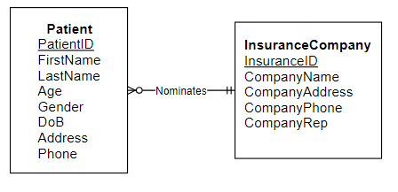
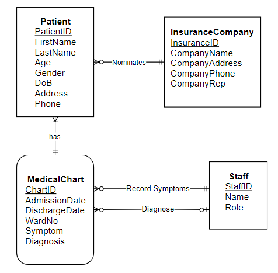
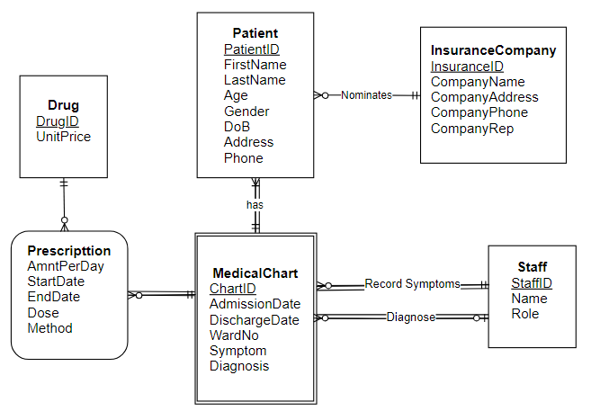

# Tutorial 2

## Tutorial Activities

### New Orient Hospital Case Study

>New Oriental Hospital (NOH) is a small private hospital run by a team of medical professionals in a local suburb. According to hospital policy, **each patient has to fill in a patient registration form** on his/her first visit. On the patient registration form each patient is **uniquely identified using patient ID**, and the form records** registration date, patient’s personal details and insurance company details. Each patient must **nominate an insurance company**, which will pay the account directly to the hospital after the patient is discharged. NOH uses a separate system to manage payment processing. Information recorded on the registration form may be updated at any time without the need to fill in another registration form.

1. Business Rules
   - Each **Patient** will fill in a from containing their personal details on their first visit.
   - Each patient will have a UID to be identified
   - Each Patient must nominate an Insurance Company
2. Draw ERD

### Medical Chart

> A new patient **medical chart form** is completed by hospital staff for each patient visit, and is numbered using the patient chart number. A staff **nurse is responsible for recording patient’s symptoms** on the medical chart before the patient is diagnosed by a doctor. A **doctor is responsible for recording the diagnosis** and **prescribed medication**. Patients may be assigned a different doctor for each visit. Patients that need to be hospitalized are **allocated to a ward**.

1. Business Rule
   - A medical chart is completed for patients by staffs each visit
   - A nurse responsible for recording symptoms
   - Doctors are responsible for diagnosing a disease/prescribing medicine for patients
   - Patients maybe assigned a different doctor each visit
   - Patiets are alocated to a ward
2. ERD Chart combined with previous parts

### Drug Prescription

> The patient medical chart form shows the **drugs prescribed by the doctor** on a particular visit. **Each drug is uniquely identified by a drug number**. Patients **may be prescribed several drugs**; the amount per day and the period covered by the prescription **(start date to end date)** as well as details of the drug are recorded on the form.

1. Business Rules
   - Each Drug has a unique number
   - Patient are perscibed multiple drugs
   - Amount/day, start & end date in on the prescription
2. ERD combine with previous ERD

