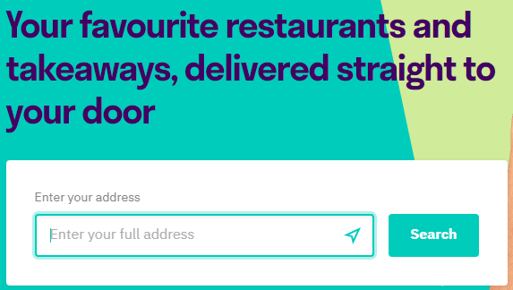
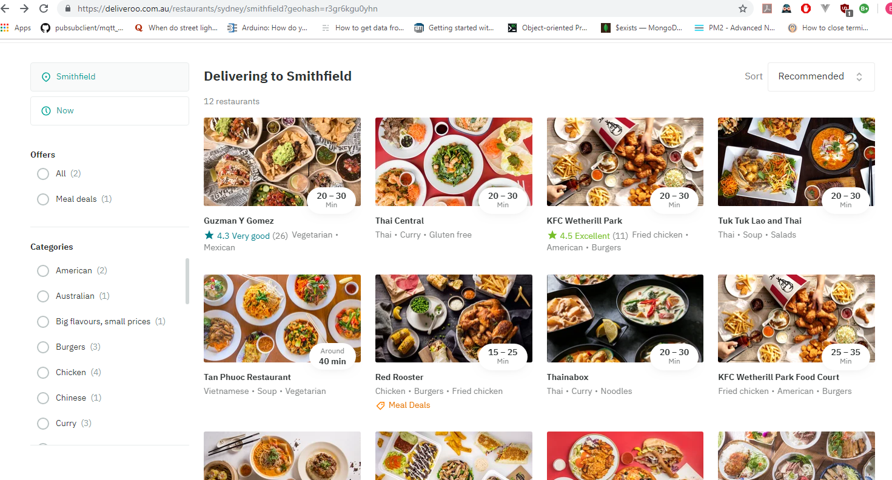
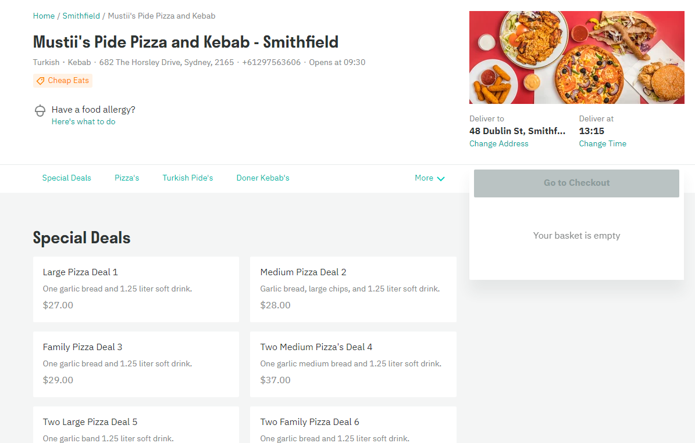
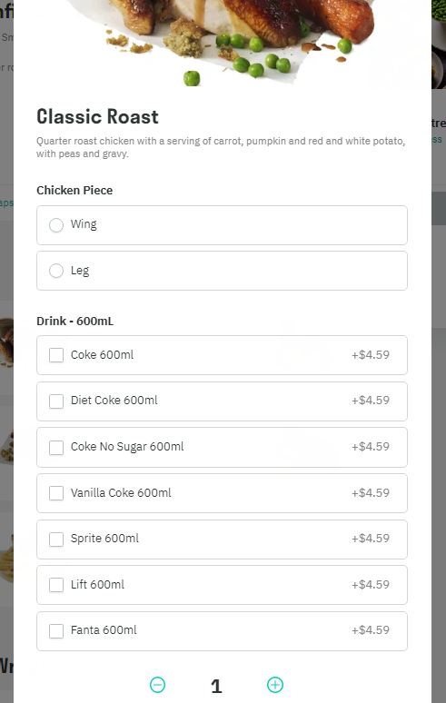
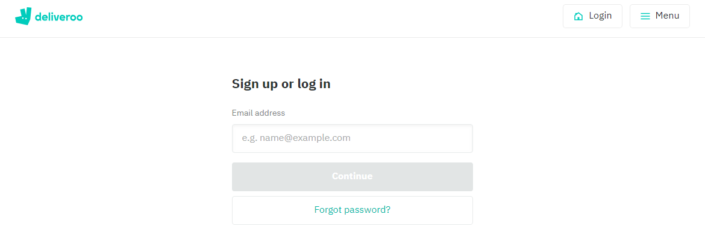
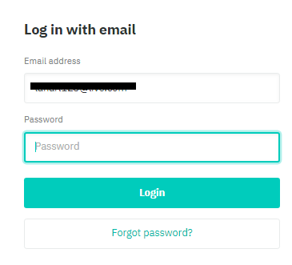
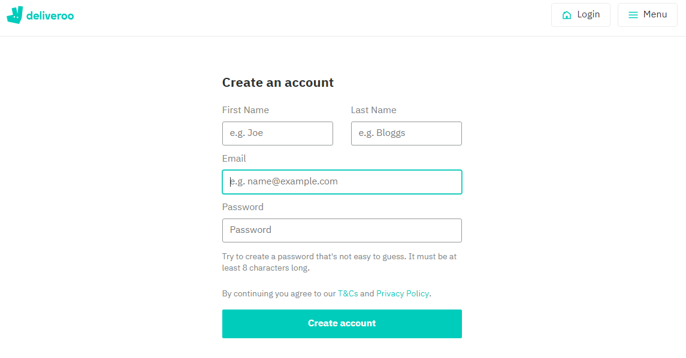
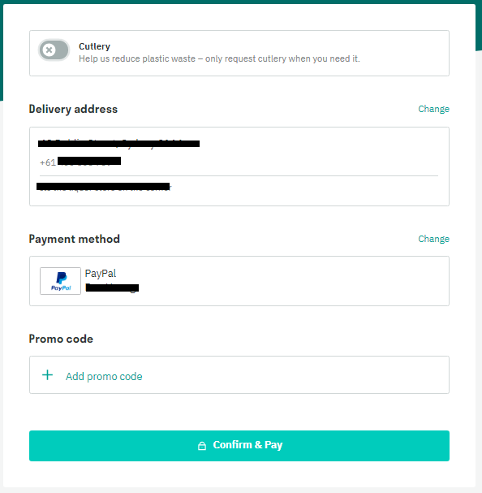
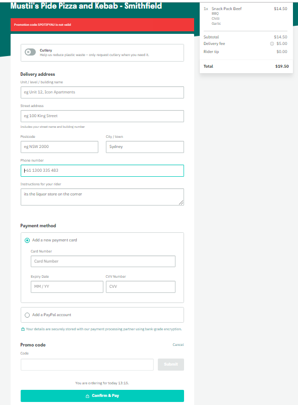

## Database Design

GroupName: Tut1-02-01 NotNoSql

# Part A

## Case Study

The Food Delivery Service **Deliveroo** can be accessed either on **deliveroo.com.au** or on their iOs/Android app counterpart. Through their service, customers can order food from nearby participating restaurants to order food to be delivered to them. Before ordering, customers must provide their current location or desired delivery address either in a textbox **(Fig1)** or through gps location tracking. This address will be used to query a list of nearby participating restaurants **(Fig2)** for customers to order from.

> 
> 
> **Fig1** Beginning Address Entry

> 
>
> **Fig2** Restaurant List

From the queried restaurant list in **Fig2** above, customers can further filter availibe restaurants based on the cusine type. Selecting a restaurant will redirect the user to a nother page displaying a list of meals offered by the selected restaurant,where meals are grouped and seperated by categories as seen in **Fig3** below.

> 
>
> **Fig3** Meal Menu

Upon selecting a meal to add to the order, customers can then further customise the selected meal to their liking(meal size, toppings, add-ons) see **Fig4**.

> 
>
> **Fig4** Meal Options

On order checkout, **Deliveroo** will ask the user to login or sign up if they have not done so prior to making the order. The service will then only ask for the user's email(**Fig5**) to check with the database if they have already have an account already. If the user already have an account, **Deliveroo** will ask for a matching password to sign in **Fig6**. If not, they will be asked to create a new account using the form in **Fig7**

> 
> 
> **Fig5** Email

> 
> 
> Fig6 Email Found

> 
> 
> Fig7 Email Not found

The User will get one final chance to validate if all details is correct or not. This includes the Order, delivery address and Payment Method, as seen in Fig8. If there are any information missing(payment detail/ delivery address) they will need to complete the form in **Fig9** before completing their purchase

> 
> 
> **Fig8** CheckOut

> 
> 
> **Fig9** Missing Payment Method & Address

---

## Database functions

- The system should be able to query nearby availible restaurants based on the location the user provided. It would also queries restaurants by cusine type
- The login/signup page will be only asking for User's email **(Fig1 above)**, the server will check if that user exist in the db or not. If yes the site will ask for the login password. If no the site will be redirected in to the sign in page to create a new user
- The Db should allow users to store multiple different delivery addresses and multiple different payment methods(card details/ paypal accounts).
- The System should be able to calculate total cost of the order, taking in account of the costs of the chosen meals, its addons and the delivery cost.
- The system should be able to limit one promo code per order & calculate the discounted cost of the order.

---

## Data Requirements

- **User**: to store user information
  - User( <u>UserId</u>, UserFname, UserLName, UserEmail, UserPassword)
- **Address**(<u> AddressID, UserId*</u>, AddressNumber, Address Street, AddressPostCode, AddressCity)
  - FK (UserId) references User
- **PaymentMethods**(<u> PaymentMId, UserId*</u>)
  - FK (UserId) references User
  - this should be a supertype entity with 2 subtypes: Paypal & Card
    - Paypal(<u>PaymentId</u>, PaypalEmail)
    - Card(<u>PaymentID</u>, CardNo, CardExpiryDate, CardholderName, CardSecurityNumber) 
    - **Note**: as these are sensitive information the actual card details would not be stored. It will be converted into a hash (similar to how password is stored)
- **Orders**: pending order/ past order
  - Order(<u>OrderID, RestaurantID*</u>, OrderCost, OrderDate, OrderStatus, UserID*, PaymentId*, AddressId*)
    - FK (RestaurantID) references Restaurant
    - FK (UserID) reference User
    - FK (PaymentId) reference PaymentMethods
    - FK ( AddressID) reference Address
- **Meals**: Meals offered by a restaurant
  - Meals(<u>MealID,RestaurantID*</u>, MealName, MealPrice, MealCategory)
- **Restaurant**(<u>RestaurantID</u>, RestaurantName, RestaurantNum, RestaurantStreet, RestaurantPostCode, RestaurantCity, RestaurantCusine)

> **NOTE** This is just a representation of a first draft of the db system, it only presents the main entities of the db to store important data, the system still need to go through a number of iterations to be complete.

---

## Business Rules

- **User BR**
  - Each User should be able to store multiple payment methods & delivery address in their account
  - Each users will need to have a Unique Email, but for security & privacy reasons an auto generated UniqueID will be used to identify each users instead of the emails.
  - When signing up, If the email already exist in the database, the user will be prompt to sign in with a matching password for the account
- **Restaurants BR**
  - The list of restaurants a user could order from is based on the distance
  - The list of restaurants should be able to be filtered by cuisine type
- **Menu BR**
  - Each restaurants are able to offer multiple different meals & the meals are speparated into different categories set by the restaurant owner.
  - users should be able to customise their meals with different options(size, extra toppings) if they wish to.
- **Ordering BR**
  - For logistics reasons & to keep delivery cost low, each order should only contain meals from 1 restaurant.
  - Users should be able to order multiple different meals per order(cart)
  - users should be able to view & edit details such as delivery address & payment method before confirming the order.
  - users should be able to add promotional code for discounts to orders.
  - Each order can not have more than one promo code applied.

